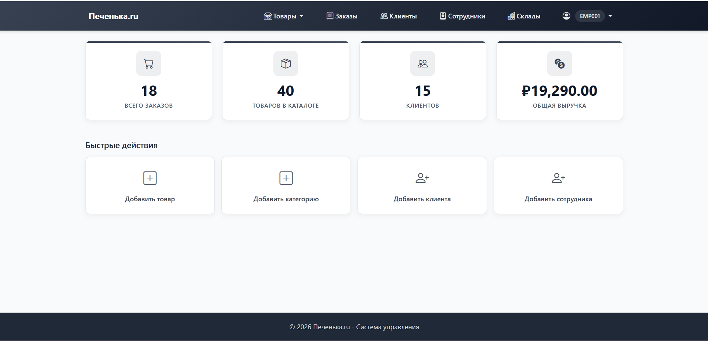

### Лесникова Полина ИТ - 6 ИКМ

# Система управления "Печенька.ru"

Система управления "Печенька.ru" представляет собой веб-приложение для администрирования магазина печенья. 

## Технологии:
- Backend: Spring Boot
- Frontend: HTML, CSS, JavaScript
- База данных: PostgreSQL

## Основные модули:
- Категории товаров - управление категориями
- Товары - управление ассортиментом с привязкой к категориям
- Остатки на складе - контроль складских запасов
- Склады - управление складскими помещениями
- Клиенты - управление клиентской базой
- Сотрудники - управление персоналом и ролями
- Заказы - обработка и отслеживание заказов

## Функциональность:
- Категории товаров
    - Просмотр списка категорий
    - Добавление новой категории
    - Редактирование категории
    - Удаление категории
    - Поиск по названию категории
- Товары
    - Просмотр списка товаров с фильтрацией
    - Добавление нового товара
    - Редактирование товара
    - Удаление товара
    - Поиск по названию, описанию
    - Привязка к категории через выпадающий список
- Остатки на складе
    - Просмотр остатков с фильтрацией по статусу (низкие/все)
    - Добавление записи об остатках
    - Редактирование количества товара
    - Удаление записи об остатках
    - Выбор товара и склада через выпадающие списки
- Заказы
    - Просмотр списка заказов с фильтрацией по статусу
    - Детальный просмотр заказа с составом
    - Изменение статуса заказа через выпадающий список
    - Просмотр заказов конкретного клиента
    - Удаление заказа
- Клиенты
    - Просмотр списка клиентов с поиском
    - Добавление нового клиента
    - Редактирование контактных данных
    - Удаление клиента
- Сотрудники
    - Просмотр списка сотрудников
    - Добавление нового сотрудника
    - Редактирование данных сотрудника
    - Удаление сотрудника
    - Выбор роли через выпадающий список
- Склады
    - Просмотр списка складов
    - Добавление нового склада
    - Редактирование информации о складе
    - Удаление склада
    - Поиск по названию и адресу

## Навигационная структура:
```
Главная
├── Товары
│   ├── Все товары
│   ├── Категории
│   └── Остатки
├── Заказы
├── Клиенты
├── Сотрудники
├── Склады
└── Профиль пользователя
    └── Выход
```

## Структура проекта:
```
src/
├── main/
│   ├── java/
│   │   └── com/pechenka/app/
│   │       ├── PechenkaRuApplication.java
│   │       ├── config/
│   │       │   └── SecurityConfig.java
│   │       ├── controller/
│   │       │   ├── AuthController.java
│   │       │   ├── CategoryController.java
│   │       │   ├── CustomerController.java
│   │       │   ├── CustomErrorController.java
│   │       │   ├── DashboardController.java
│   │       │   ├── EmployeeController.java
│   │       │   ├── OrderController.java
│   │       │   ├── OrderStatusController.java
│   │       │   ├── ProductController.java
│   │       │   ├── StockController.java
│   │       │   ├── WarehouseController.java
│   │       │   └── WarehouseOperationController.java
│   │       ├── entity/
│   │       │   ├── Category.java
│   │       │   ├── Customer.java
│   │       │   ├── Employee.java
│   │       │   ├── Order.java
│   │       │   ├── OrderItem.java
│   │       │   ├── OrderStatus.java
│   │       │   ├── Product.java
│   │       │   ├── Stock.java
│   │       │   ├── Warehouse.java
│   │       │   └── WarehouseOperation.java
│   │       ├── repository/
│   │       │   ├── CategoryRepository.java
│   │       │   ├── CustomerRepository.java
│   │       │   ├── EmployeeRepository.java
│   │       │   ├── OrderRepository.java
│   │       │   ├── OrderStatusRepository.java
│   │       │   ├── ProductRepository.java
│   │       │   ├── StockRepository.java
│   │       │   ├── WarehouseOperationRepository.java
│   │       │   └── WarehouseRepository.java
│   │       └── service/
│   │           ├── CategoryService.java
│   │           ├── CustomerService.java
│   │           ├── CustomUserDetailsService.java
│   │           ├── EmployeeService.java
│   │           ├── OrderService.java
│   │           ├── OrderStatusService.java
│   │           ├── ProductService.java
│   │           ├── StockService.java
│   │           ├── WarehouseOperationService.java
│   │           └── WarehouseService.java
│   └── resources/
│       ├── application.properties
│       ├── static/
│       │   ├── css/
│       │   │   └── style.css
│       │   └── js/
│       │       └── app.js
│       └── templates/
│           ├── admin/
│           │   ├── categories/
│           │   │   ├── form.html
│           │   │   ├── list.html
│           │   │   └── view.html
│           │   ├── customers/
│           │   │   ├── form.html
│           │   │   ├── list.html
│           │   │   └── view.html
│           │   ├── employees/
│           │   │   ├── form.html
│           │   │   ├── list.html
│           │   │   └── view.html
│           │   ├── orders/
│           │   │   ├── list.html
│           │   │   └── view.html
│           │   ├── products/
│           │   │   ├── form.html
│           │   │   ├── list.html
│           │   │   └── view.html
│           │   ├── stock/
│           │   │   ├── form.html
│           │   │   └── list.html
│           │   └── warehouses/
│           │       ├── dashboard.html
│           │       ├── form.html
│           │       ├── list.html
│           │       └── view.html
│           └── auth/
│               ├── login.html
│               └── error.html
```

## Структура базы данных:

