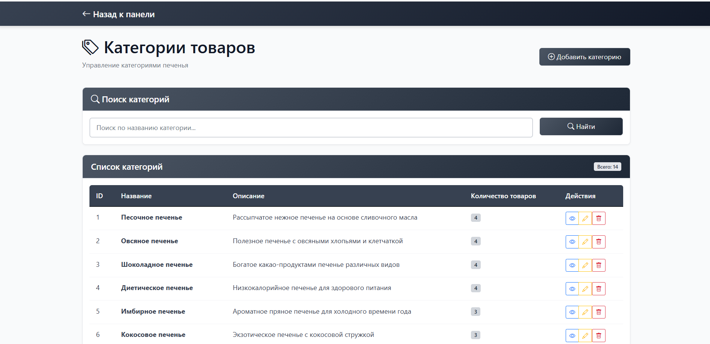
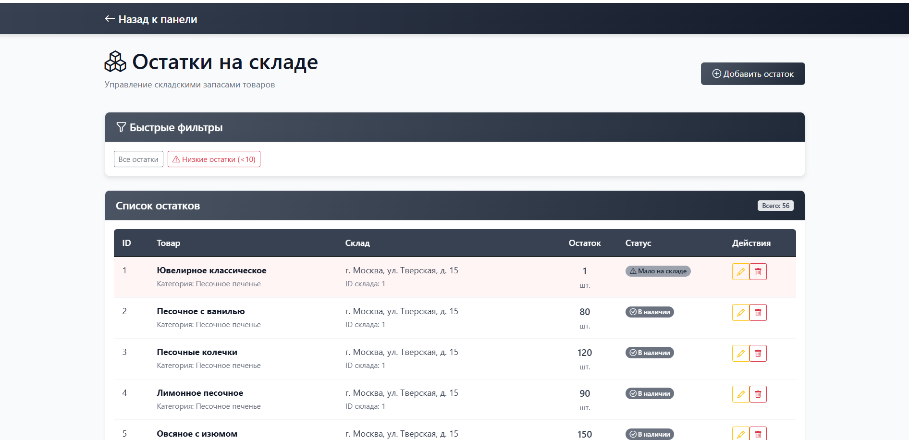
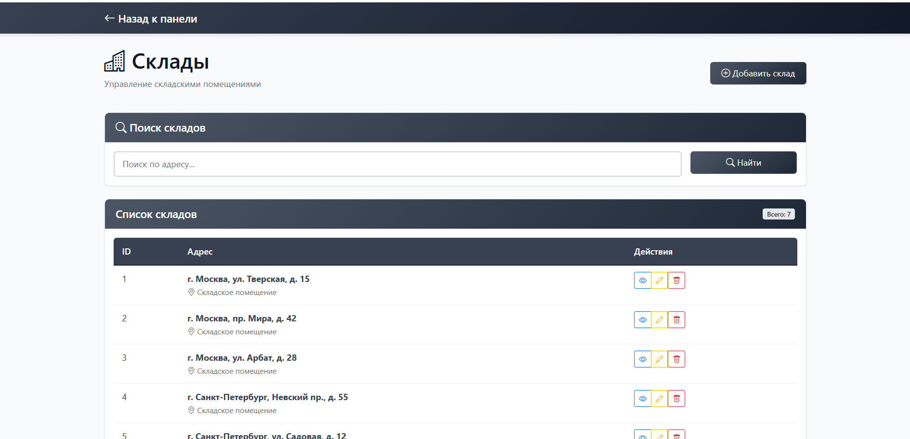
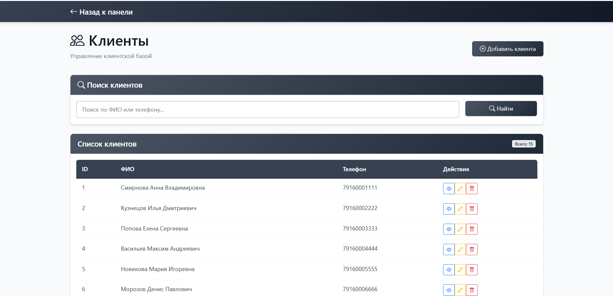
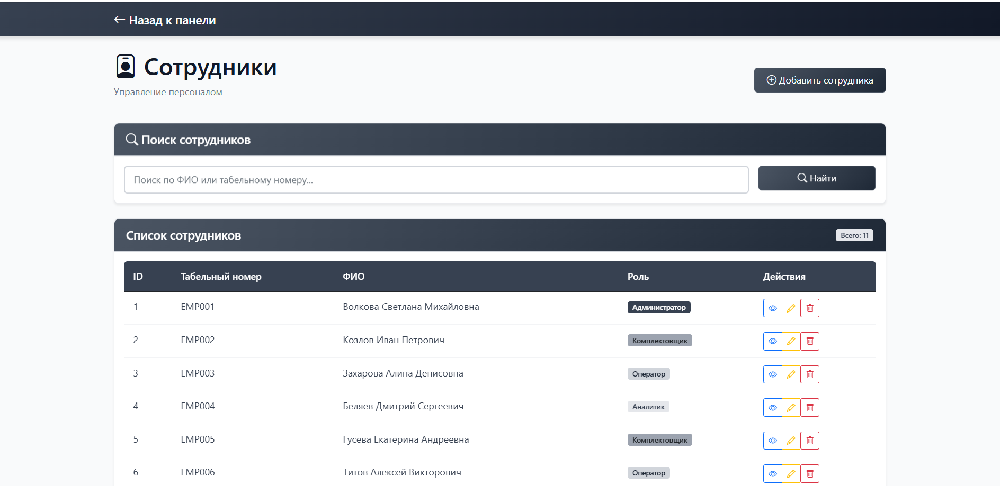
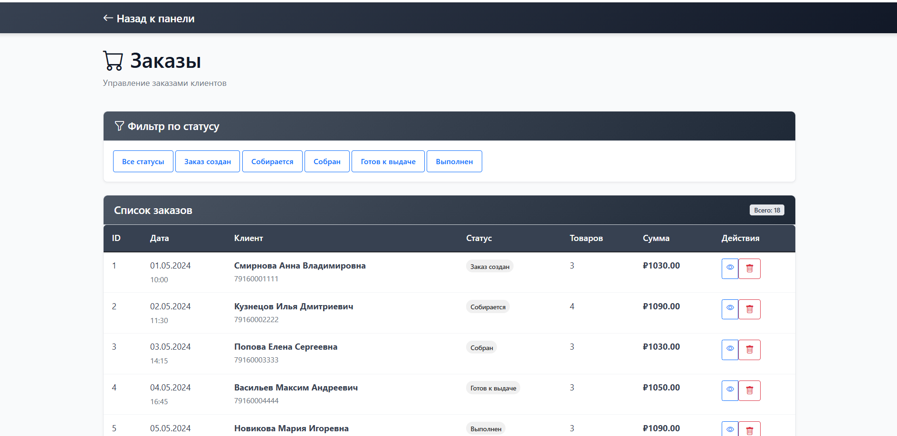

### Лесникова Полина ИТ - 6 ИКМ

# Система управления "Печенька.ru"

Система управления "Печенька.ru" представляет собой веб-приложение для администрирования магазина печенья. 

## Технологии:
- Backend: Spring Boot
- Frontend: HTML, CSS, JavaScript
- База данных: PostgreSQL

## Основные модули:
- Категории товаров - управление категориями


- Товары - управление ассортиментом с привязкой к категориям


- Остатки на складе - контроль складских запасов


- Склады - управление складскими помещениями


- Клиенты - управление клиентской базой


- Сотрудники - управление персоналом и ролями


- Заказы - обработка и отслеживание заказов


## Навигационная структура:
```
Главная
├── Товары
│   ├── Все товары
│   ├── Категории
│   └── Остатки
├── Заказы
├── Клиенты
├── Сотрудники
├── Склады
└── Профиль пользователя
    └── Выход
```

## Структура проекта:
```
src/
├── main/
│   ├── java/
│   │   └── com/pechenka/webapp/
│   │       ├── PechenkaRuApplication.java
│   │       ├── config/
│   │       │   ├── MvcConfig.java
│   │       │   └── SecurityConfig.java
│   │       ├── controller/
│   │       │   ├── HomeController.java
│   │       │   ├── CategoryController.java
│   │       │   ├── ProductController.java
│   │       │   ├── StockController.java
│   │       │   └── WarehouseController.java
│   │       ├── entity/
│   │       │   ├── Category.java
│   │       │   ├── Product.java
│   │       │   ├── Stock.java
│   │       │   └── Warehouse.java
│   │       ├── service/
│   │       │   ├── CategoryService.java
│   │       │   ├── ProductService.java
│   │       │   ├── StockService.java
│   │       │   └── WarehouseService.java
│   │       ├── repository/
│   │       │   ├── CategoryRepository.java
│   │       │   ├── ProductRepository.java
│   │       │   ├── StockRepository.java
│   │       │   └── WarehouseRepository.java
│   │       └── exception/
│   │           └── GlobalExceptionHandler.java
│   └── resources/
│       ├── static/
│       │   ├── css/
│       │   │   └── style.css
│       │   └── js/
│       │       └── main.js
│       ├── templates/
│       │   ├── categories/
│       │   │   ├── list.html
│       │   │   └── form.html
│       │   ├── products/
│       │   │   ├── list.html
│       │   │   └── form.html
│       │   ├── stock/
│       │   │   ├── list.html
│       │   │   └── form.html
│       │   ├── warehouses/
│       │   │   ├── list.html
│       │   │   └── form.html
│       │   ├── index.html
│       │   ├── login.html
│       │   └── error.html
│       └── application.properties
```

## Структура базы данных:

